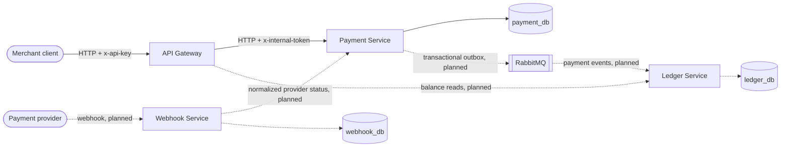

# Payment Orchestration Platform


A TypeScript microservices platform that demonstrates **reliability engineering in a payment domain**: idempotent money movement, crash-safe processing leases, fail-closed security and contract-first HTTP APIs — built test-first, with the trade-offs documented as ADRs.

> This project intentionally uses only four services. The goal is not to create as many services as possible, but to demonstrate clear service boundaries, data ownership and reliability patterns in a payment domain.

**Status: in active development.** The create/authorize flow, the idempotency layer and a reliability & security hardening pass are complete and tested. Capture, eventing, ledger and webhooks are on the [roadmap](#roadmap).

## Architecture



| Service | Responsibility | Owns |
| --- | --- | --- |
| **api-gateway** | Public API, API-key auth, request validation, routing to internal services. Never touches a database. | — |
| **payment-service** | Payment lifecycle (create/authorize today; capture planned), idempotency, provider adapters. | `payment_db` |
| **ledger-service** | Append-only financial records and balances (planned). | `ledger_db` |
| **webhook-service** | Provider webhook verification, dedup and normalization (planned). | `webhook_db` |

Hard boundaries, enforced by architecture tests in CI:

- No shared domain or service runtime code — business logic, containers and service classes are deliberately duplicated per service. The only shared package is `openapi-kit`, an internal contract/documentation tool with no domain logic.
- Each service owns exactly one database; services never read each other's tables.
- Route → controller → service → data-access/client layering with constructor injection (Awilix).
- OpenAPI documents are **generated from route metadata + Joi schemas** — the runtime routes and the published contract cannot drift.

## Reliability & security engineering

The interesting parts, all covered by tests:

- **Idempotent payment creation** — every mutating request carries an `idempotency-key`. Keys are scoped per merchant, request bodies are canonicalized and hashed (SHA-256), and replays return the original response (including its status code) without touching the provider. Reusing a key with a different body returns `409`.
- **Crash-safe processing leases** — an in-flight idempotency record holds a `processing_expires_at` lease. If a process dies mid-payment, the lease expires and a retry can take over the record; a conditional DB update guarantees only one winner. Stuck idempotency records self-heal without manual intervention (provider-side effects are a separate concern — see [ADR 006](docs/adr/006-provider-authorize-before-persistence.md)).
- **Stable provider reference** — the payment id is reserved when the idempotency record is created and survives retries and lease takeovers, so a provider always sees the same reference for the same logical payment (double-charge mitigation; see [ADR 006](docs/adr/006-provider-authorize-before-persistence.md)).
- **Fail-closed configuration** — missing secrets (`INTERNAL_SERVICE_TOKEN`, `PUBLIC_API_KEY`) or invalid numeric config fail at boot, not silently at request time. Token comparisons are timing-safe.
- **Bounded outbound calls** — gateway→payment-service calls have timeouts (`504`/`502` mapping); GETs retry once on transport errors only; mutating POSTs never auto-retry.
- **Database integrity as a last line** — CHECK constraints on payment status, currency and positive amounts; `updated_at` maintained by triggers; amounts capped below the JS safe-integer precision boundary.
- **Closed by default** — Swagger UI requires `OPENAPI_DOCS_ENABLED=true`; CORS is off unless `CORS_ALLOWED_ORIGINS` is set; auth runs before validation so unauthenticated callers can't probe schemas.

## Getting started

Requires Docker and Node 20+.

```bash
npm ci

# start postgres, redis, rabbitmq and all four services
docker compose -f infra/docker-compose.yml up -d --build

# run payment-service migrations
docker compose -f infra/docker-compose.yml exec payment-service npm run migrate
```

Services start before migrations are applied; the payment endpoints need the migration step above before the first request. Automated migration ordering (deploy pipeline / one-off job) is a documented roadmap item.

Create and fetch a payment through the gateway:

```bash
curl -s -X POST http://localhost:8080/api/v1/payments \
  -H 'content-type: application/json' \
  -H 'x-api-key: local-public-api-key' \
  -H 'idempotency-key: demo-key-0001' \
  -d '{"merchantId":"11111111-1111-4111-8111-111111111111","amountMinor":1000,"currency":"TRY"}'

curl -s http://localhost:8080/api/v1/payments/<paymentId> \
  -H 'x-api-key: local-public-api-key'
```

Replay the same `POST` with the same key and body — you get the same payment back and the provider is not called twice. Change the body while keeping the key — you get `409 IDEMPOTENCY_KEY_REUSED_WITH_DIFFERENT_REQUEST`.

Interactive API docs (enabled in the dev compose file): http://localhost:8080/api-docs

### Key environment variables

| Variable | Purpose |
| --- | --- |
| `PUBLIC_API_KEY` | Gateway API key (boot-fails if missing) |
| `INTERNAL_SERVICE_TOKEN` | Service-to-service auth token (boot-fails if missing) |
| `PAYMENT_SERVICE_TIMEOUT_MS` | Gateway outbound timeout (default 5000) |
| `IDEMPOTENCY_PROCESSING_LEASE_MS` | In-flight idempotency lease (default 60s) |
| `IDEMPOTENCY_COMPLETED_TTL_MS` / `IDEMPOTENCY_FAILED_TTL_MS` | Retention timestamps for finished records |
| `OPENAPI_DOCS_ENABLED` | Swagger UI, off unless `"true"` |
| `CORS_ALLOWED_ORIGINS` | CORS whitelist, CORS disabled when unset |

## Testing

Built strictly test-first (red → green → refactor). Four layers:

| Layer | What it locks down | Run |
| --- | --- | --- |
| Architecture tests | Service boundaries, no shared runtime code, security guardrails (no wildcard CORS, timing-safe auth, amount ceiling) | `npm run test:architecture` |
| Unit tests | Domain rules: idempotency decisions, retry/timeout mapping, error logging | `npm run test:unit` |
| HTTP tests | Real Express apps via supertest with container overrides — auth ordering, CORS, docs gating | part of `test:unit` |
| Integration tests | Real PostgreSQL via testcontainers — unique constraints, lease takeover races, CHECK constraints, triggers | `npm run test:integration` |

```bash
npm test                  # architecture + typecheck + unit/http
npm run test:integration  # requires Docker
```

CI (GitHub Actions) runs all of the above plus per-service Docker image builds.

## Intentionally out of scope (for now)

Documented deferrals, each with a tripwire for when it must be revisited:

- **Provider side-effect recovery** — authorization runs before persistence (MVP trade-off). Mitigated by the stable provider reference; must be revisited before integrating a real provider. [ADR 006](docs/adr/006-provider-authorize-before-persistence.md)
- **Merchant ownership & scope enforcement** — a single trusted API key exists today; merchant identity binding is a blocker before multi-merchant support. [ADR 007](docs/adr/007-merchant-ownership-deferred.md)
- Real provider adapters (PayTR/Iyzico/Stripe), rate limiting, circuit breakers, structured log shipping — tracked on the roadmap.

## Roadmap

**Delivered**

- Four-service skeleton with per-service Docker builds and CI
- Payment create/authorize flow through the gateway
- OpenAPI contracts generated from route metadata and Joi schemas
- PostgreSQL-backed idempotency with processing leases and stable provider references
- Reliability & security hardening: fail-closed config, timing-safe auth, outbound timeouts, database integrity constraints

**Next**

- Payment capture with a transactional outbox publishing to RabbitMQ

**Planned**

- Ledger service: append-only financial records, balances, event consumption
- Webhook service: signature verification, deduplication, normalization
- Reconciliation inside the ledger
- End-to-end flows, graceful shutdown, readiness probes, remaining ADRs

## Architecture Decision Records

ADRs live in [`docs/adr/`](docs/adr/). Numbers 001–005 are reserved for foundational write-ups; 006+ record decisions made along the way.

## License

[MIT](LICENSE)
